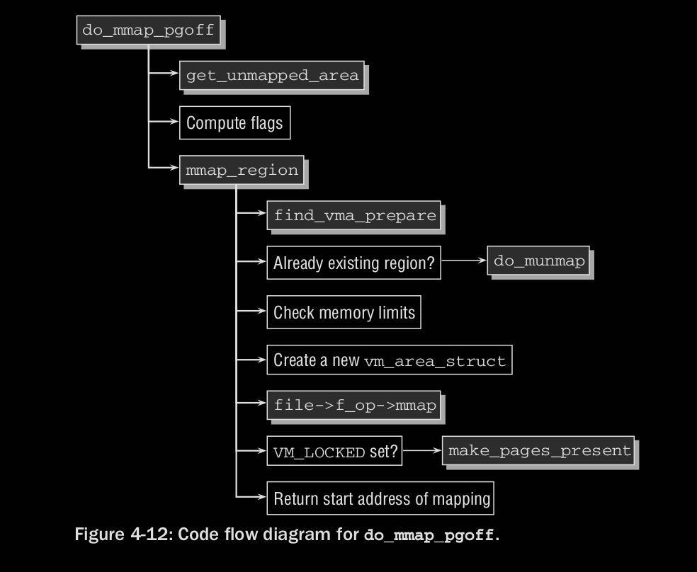
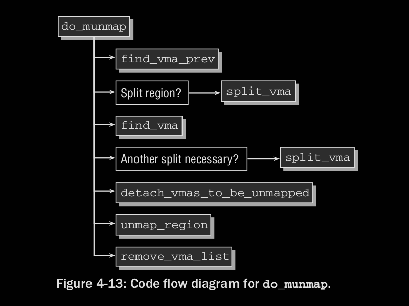
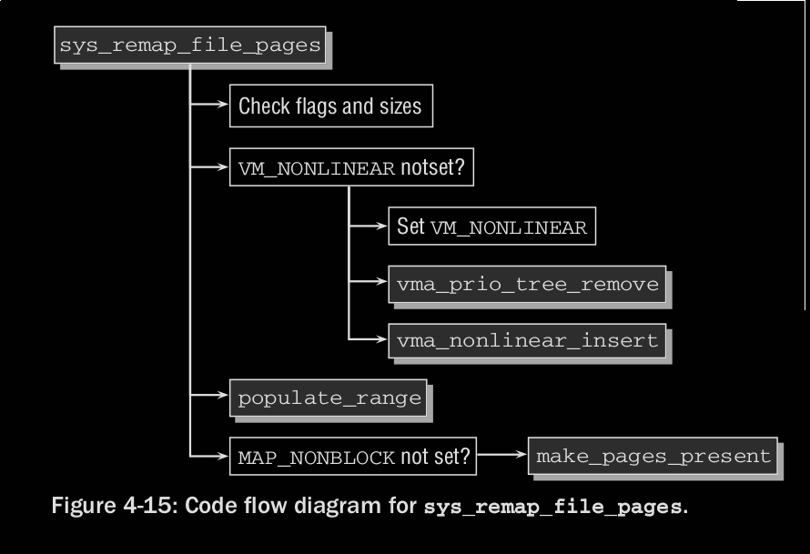

## Memory Mappings

```c
asmlinkage unsigned long sys_mmap{2}(unsigned long addr, unsigned long len,
        unsigned long prot, unsigned long flags, unsigned long fd,
        unsigned long off)
```

### Create Mappings

mmap ---> sys_mmap ---> do_mmap_pgoff

#### flags

* MAP_FIXED 不允许动态改变大小
* MAP_SHARED 当一个object(如文件)需要在不同进程之间共享时，需要指定
* MAP_PRIVATE 创建私有拷贝，对私有区间的写操作不会改变原有内容
* MAP_ANONYMOUS 创建一个匿名映射，不关联到任何数据源

#### prot

* PROT_EXEC
* PROT_READ
* PROT_WRITE
* PROT_NONE
只能保证获得权限不比申请的更低

#### do_mmap_pgoff



* get_unmapped_area 寻找合适的虚拟地址区域:
    * 给定固定地址
    * 推荐地址
    * 交给内核处理
* compute flags:
    * `vm_flags = calc_vm_prot_bits(prot) | calc_vm_flag_bits(flags) | * mm->def_flags | VM_MAYREAD | VM_MAYWRITE | VM_MAYEXEC;`
    * MAP_xxx 和 PROT_xxx 被翻译成 VM_xxx
    * def_flags 为0或者VM_LOCK, 如果是VM_LOCK表明页表不能被换出
* mmap_region
    * 通过find_vma_prepare 来寻找vm_area_struct实例, 如果一个映射已经存在，则通过do_munmap来移除
    * vm_enough_memory 被调用，如果MAP_NORESERVE flag未被置位，或者内核参数 sysctl_overcommit_memory 被设置为 OVERCOMMIT_NEVER，如果检查失败，返回ENOMEM
* 一旦内核接收到需求的内存，进行如下步骤:
    1. 初始化vm_area_struct实例，插入进程的 list/tree 数据结构
    2. 创建映射：file->f_op->mmap. `vma->vm_ops = &generic_file_vm_ops;` generic_file_vm_ops的核心成员是filemap_fault,当一个应用程序访问了一段区间，其对应的数据还未存在于RAM的时候被调用。即映射的数据在被需要的时候才被填充到RAM。
* 如果VM_LOCKED置位，调用make_pages_present 确保内存页的数据被读入。(需要先读入数据再对其加锁以放置换出)
* 新映射的起始地址作为该系统调用的返回值

##### checking

* Accounting: 一个进程所占用的映射页表数量可以被限制，且被内核统计维护。如果超出限制，则返回该错误。每个进程还有个共同的最大映射数。
* Extensive security & plausibility: 检查无效的参数，威胁性的参数。如比虚拟地址空间还大的映射。

### Removing Mappings

munmap ---> sys_munmap ---> do_munmap

#### do_munmap



* 需要通过find_vma_prev来找到 vm_area_struct 实例，与find_vma的执行流程相同，但是会附加一个指向前继区域的指针
* 如果将要取消映射的区域的起始位置不在find_vma_prev返回的区域的起始位置，只有部分的映射区域会被取消映射。内核需要将已经产生的映射映射分成不同区域
    * 头部区域不会被unmap被split_vma划分开
* detach_vmas_to_be_unmapped 制定所有将被unmap区域的列表。
    * 在vm_area_struct实例组成的列表内遍历，直到整个区域被覆盖。设置mmap cache 为NULL
* unmap_region 将所有映射相关的页表项移除，相应的TLB表项标志为无效。通过remove_vma_list来最终将所有的vm_area_struct清空


### Nonlinear Mappings

通常映射一个文件的不同部分到虚拟地址需要多次映射，用非线性映射就不需要。

```c
logn sys_remap_file_pages(unsigned long start, unsigned long size,
        unsigned long prot, unsigned long pgoff, unsigned long flags)
```

* 这一系统调用允许重组一个映射中的页表，使得内存中的顺序与文件中的顺序并不一致，实现手段是通过操作进程页表。
* 当一个非线性映射被换出时， kernel需要确保当这个映射被重新换入时offsets仍然保持有效，实现的信息存放在页表项中。信息编码:
    * 所有非线性映射相关的vm_area_struct实例被address_space结构体中一个以i_mmap_nonlinear为头的列表串起来，每个vm_area_structs中的shared.vm_set.list作为列表元素。
    * 映射区域的页表项被特殊生成，看上去像是不存在的页表项，但是被标记为非线性映射。
    * 当该PTE对应的页被访问时，page fault产生，正确的页被读入。
* 生成非线性PTE需要体系结构对应的代码，必须声明三个函数：
    1. pgoff_to_pte 读取一个文件的offset，编码为一个page number存储在页表中。
    2. pte_to_pgoff 反之
    3. pte_file(pte) 检查给定的pte是否被用于表示非线性映射
* 常数PTE_FILE_MAX_BITS标识了多少bits可以用于表示文件offset

#### sys_remap_file_pages



* 检查flag，内核需要检测将要重新映射的区间有效
* find_vma用于查找目标区域的vm_area_struct
* 如果目标区域没有被非线性映射过，VM_NONLINEAR不会被置位(vm_area_struct->vm_flags), 线性映射需要从prio tree中移除(通过调用vma_prio_tree_remove)，之后通过vma_nonlinear_insert插入非线性映射队列
* 关键步骤是修改PTE，由populate_range负责:

```c
static int populate_range(struct mm_struct *mm, struct vm_area_struct *vma,
        unsigned long addr, unsigned long size, pgoff_t pgoff)
{
    int err;
    ...
    do {
        err = install_file_pte(mm, vma, addr, pgoff, vma->vm_page_prot);
        if (err)
            return err;
        size -= PAGE_SIZE;
        addr += PAGE_SIZE;
        pgoff++;
    } while (size);

    return 0;
}
```

* 映射区域由vma表示，length表示即将被重映射到addr的长度
* 循环遍历每个页，插入对应的页表项

```c
static int install_file_pte(struct mm_struct *mm, struct vm_area_struct *vma, 
        unsigned long addr, unsigned long pgoff, pgprot_t prot)
{
    pte_t *pte;
    ...
    if (!pte_none(*pte))
        zap_pte(mm, vma, addr, pte); // 移除已有PTE
    
    set_pte_at(mm, addr, pte, pgoff_to_pte(pgoff)); // pgoff_to_pte 将offset编码为适合PTE存放的格式
}
```

* 最后，通过make_present_pages读入映射的数据, 这个函数返回一个page fault当映射范围内的单个页表被访问,同时触发数据读入操作
